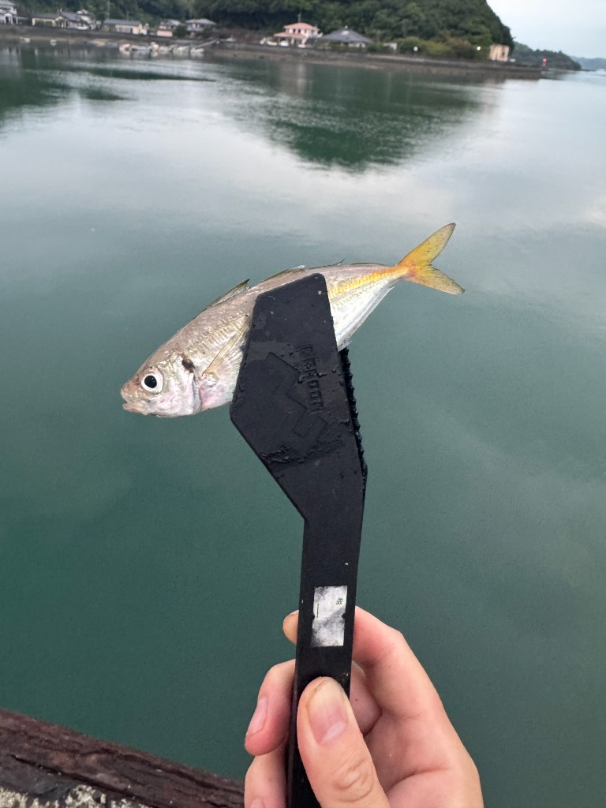
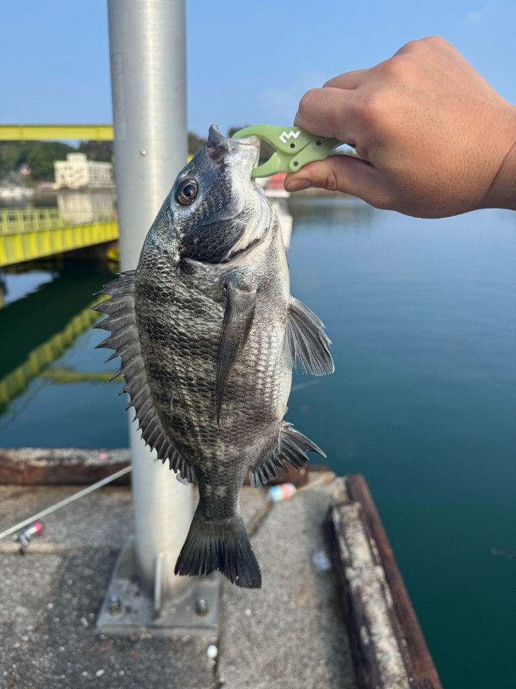
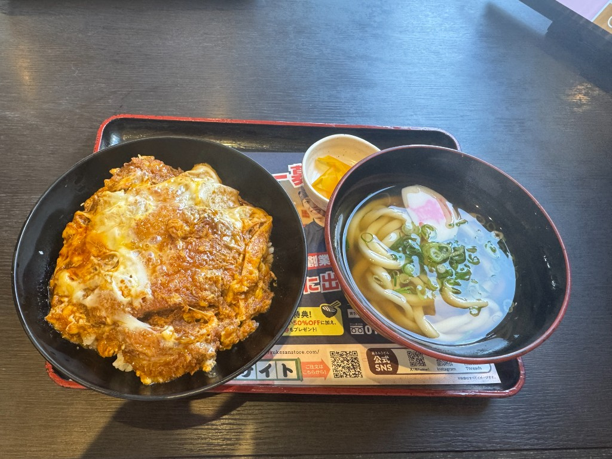

上天草まで釣りに行きました。

夜中12時頃からウキ釣りを始めたものの、明け方までヒットなし。途中でルアーもやったけど、全然ダメ。

夜が明け始めたらサビキをやろうと思っていたので、予定通りに開始。幸先よくアジが1匹釣れた。

しかし、その後が続かない。コノシロとトウゴロウイワシがぽろぽろと釣れるものの、アジは最初の1匹だけ。しかも、全部あわせても10匹にも満たない。後からやってきた親子はサビキでどんどん釣っているのに、こちらは全然釣れない。釣りが下手くそかもしれない。

日が昇ってきて、暑くなったのでそろそろ帰ろうかなあと思ったところで、重めのアタリが。上げてみるとチヌでした。チヌとしては小さめだけど、今日一の大きさ。

血抜きもしていないし、鮮度もあまり良くないと思うので、刺身はやめて塩焼きとかで食べたいと思います。

帰りに資さんうどんで、カツ丼とミニうどんのセットを食べた。なんかカツ丼がしょっぱかった気がする。

