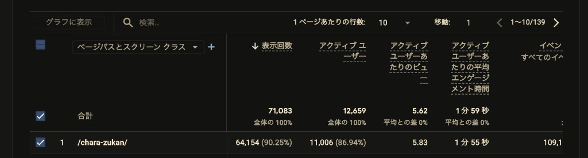

[Chara-Zukan https://tools.tadeku.net/chara-zukan/] という、自分専用のキャラクター図鑑を作成できるWebツールを [tadeku-tools https://tools.tadeku.net] で公開しました。

https://x.com/atohsaaa/status/2093545311071588623?s=20

自作のキャラクターを図鑑形式でまとめるためのツールです。作品ごとに図鑑を作れて、キャラクターの名前・読み仮名・年齢・タグ・イラスト付きのプロフィールなどを登録できます。五十音順や年齢順での並べ替えにも対応しています。データはブラウザのIndexedDBに保存されるので、サーバーには送られません。

## 公開後の反響

こちらは、公開後およそ24時間が経過した時点でのGoogle Analytics 4の分析結果のスクリーンショットです。

「アクティブユーザー数」を見ると、1万人を超えていることが分かりますね。この1万人がそれぞれどれくらい深くまでChara-Zukanを使ってくださったかまではまだ分析できていないのですが、少なくとも1万人の方に使っていただけたと言えそうです。

これまでも [tadeku-tools https://tools.tadeku.net] でさまざまなツールを公開してきましたが、過去一番の反響の大きさだったように思います。アクセス数・アクティブユーザー数で言うと [文豪診断 https://tools.tadeku.net/bungo-analysis/] の方が最大瞬間風速は大きかったのですが、こちらのツールは10問の質問に答えるだけという手軽さがあり、かつ内部にTwitterシェア機能も持っていたから広がったという事情があります。それを考えると、Chara-Zukanはかなり反響が大きいと思います。

また、上記のツイートのリプライ欄や引用ツイートを見ていただけると分かるのですが、好意的な感想をいただく方が多いのも特徴です。皆さん、使っていただいて本当にありがとうございます！

不具合報告もいくつかいただいており、これもサービスを細かいところまでご利用くださる方が多いからだという気がしています。ご報告いただいた皆さんも、ありがとうございます。おかげで、サービスリリース後に大きめの不具合はおおむね修正できたかなと思います。

## 今後について

このサービスを作っていて、ずっと思っていたことがあるんです。

**「これ、データをサーバーに保存して複数端末で見られるようにしたいよな……」**

**「作った図鑑を公開状態にして他の人に見てもらいたいよな……」**

最初のリリースでこの機能を含めることも可能といえば可能だったのですが、画像を取り扱うサービスということもあり、データをお預かりするとインフラ費用がどうなってしまうのか想像ができないという問題があったんですよね。そのため、まずはテストマーケ的に、いったんできあがったところでリリースしてみることにしました。

今後も皆さまに使っていただけて、かつご要望が多いようであれば、ログインしてデータをサーバー上に保存する機能なども作ろうかなと考えています。
