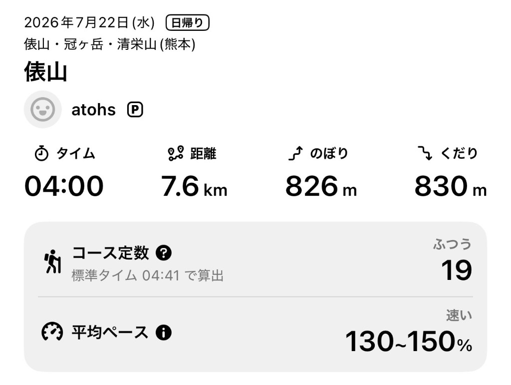
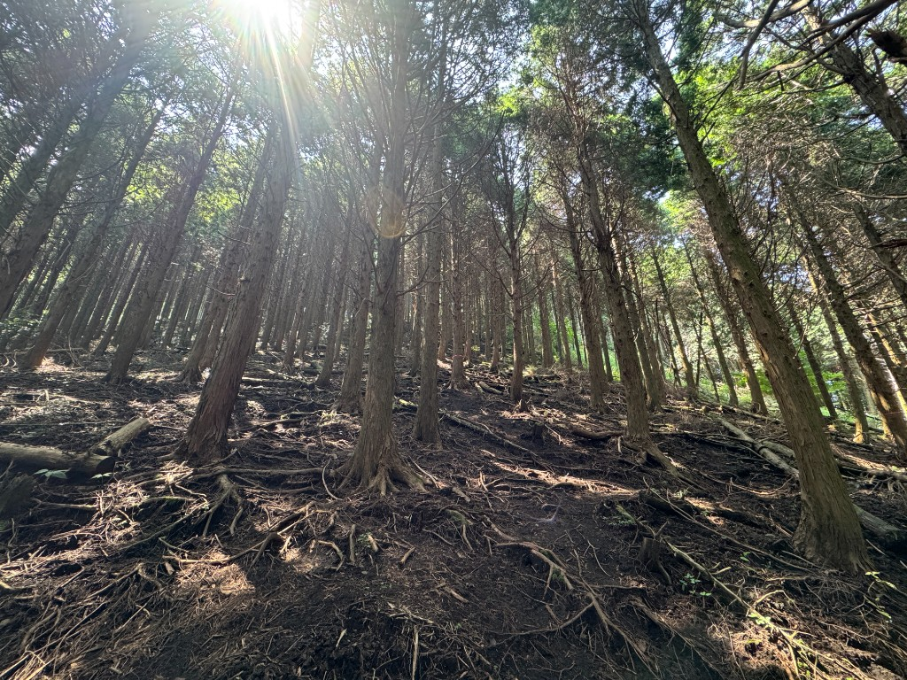
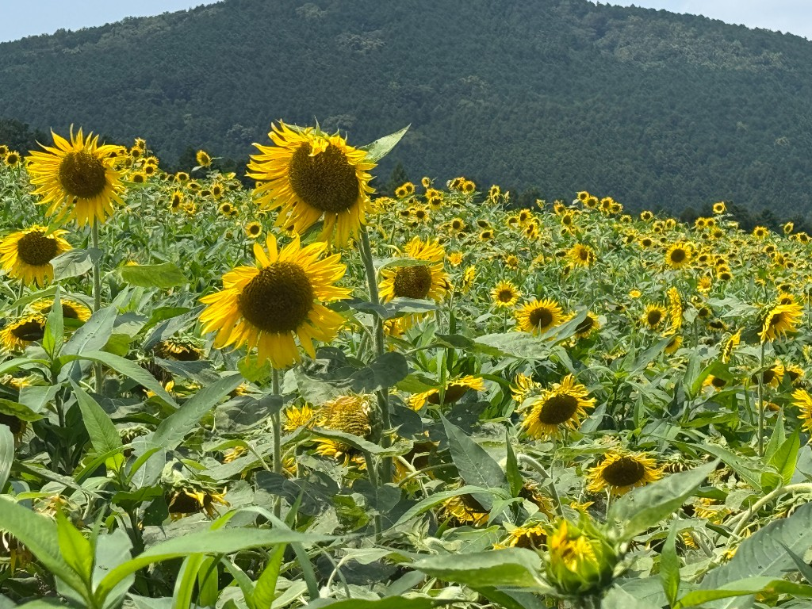
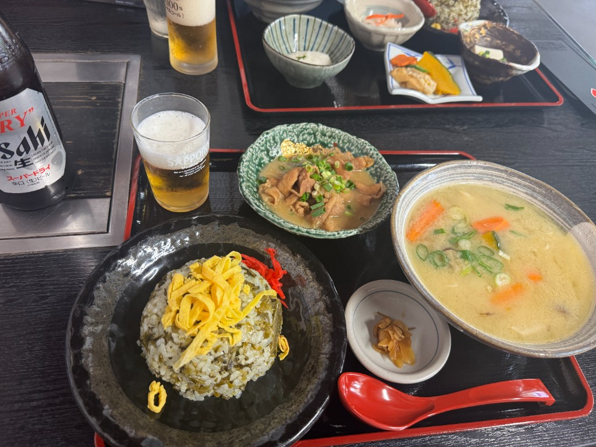

昨日は、阿蘇にある俵山に登りました。

とりあえずYAMAPのスクショを貼ります。

朝6時頃に出発し、朝ごはんを食べて、7時半くらいから登山開始。萌の里の駐車場に車を停めて登り始めました。

俵山は違うコースからも登ったことがあるのですが、登りはじめは木のないエリアが広がっていて、日差しを遮るものがなく、とにかく暑い。今回のコースは30分くらいはずっと木のないところが続くので、ジリジリと日に焼かれながら進んでいきました。前日ちょっと食べすぎた影響で胃の調子が悪く、なんだか気持ち悪くて、このエリアはかなり口数が少なかったのを覚えています。

しかし、木の生えているエリアを登り始めてからはかなり気が楽になり、そこからは楽しく登ることができました。久しぶりにしっかりと汗をかいたこともあり、自律神経が整ったのも要因なのかもしれません。

道なき道を進みます。

上の写真のエリアは傾斜もかなり強く、まさに「登山！」という感じがして楽しかったです。しかし、下りはちょっと怖かったですね。ぬかるんでいるところなどもあり、たびたび滑っていました。

下山して、萌の里に寄ってみると、ひまわりが満開でした。

その後は、乙姫まで出向き、「ひめ路」というお店で高菜飯・だご汁・もつ煮のセットを食べました。ビールも。山を登った後に昼間から飲むビールは美味い。

4時間も登山を満喫した後なのに、この時点でまだ12時過ぎ。熊本市内まで戻り、古着屋などに寄った後に帰宅しました。

楽しかったな〜。
