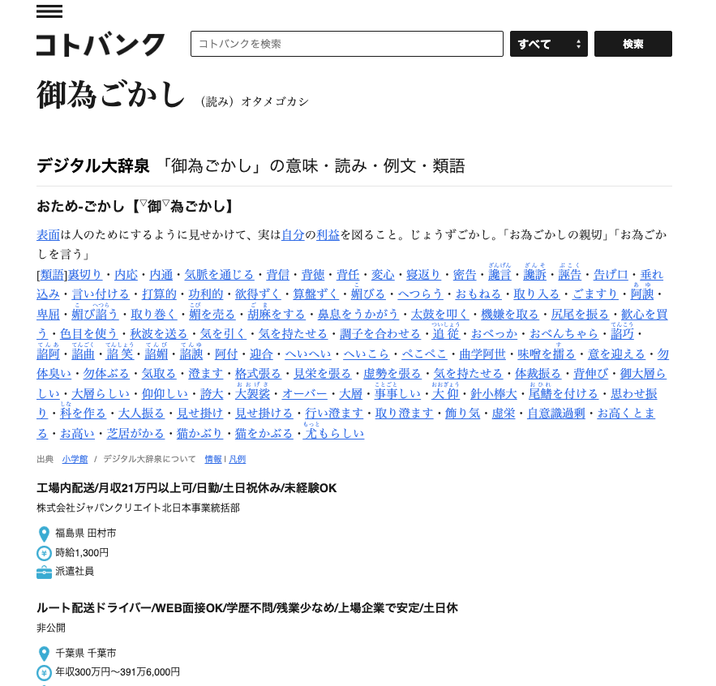
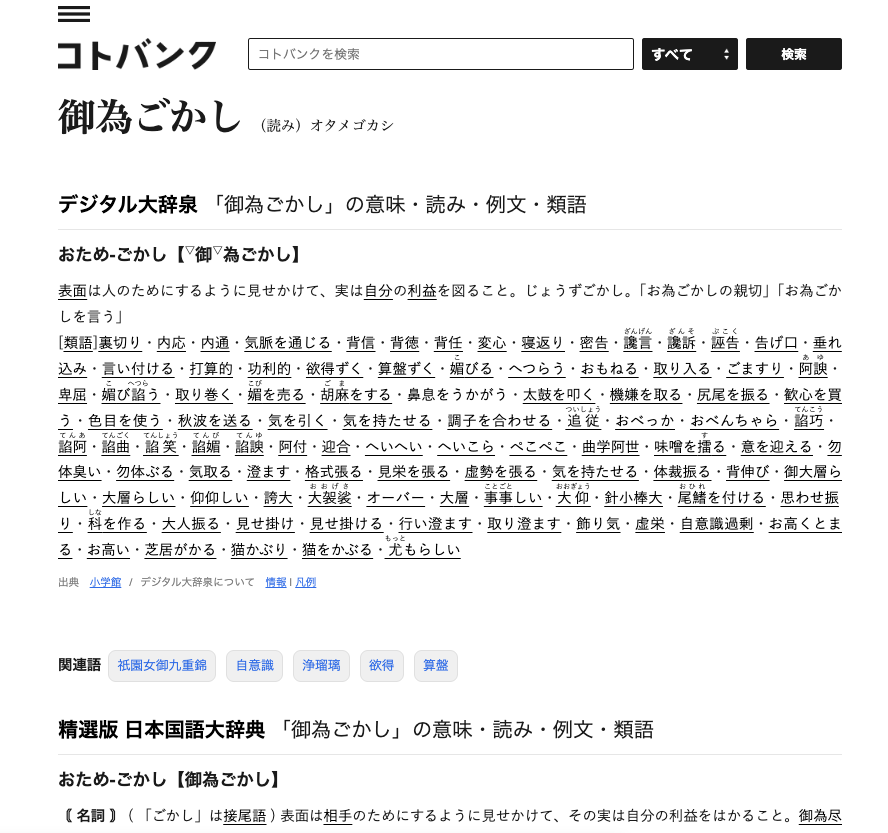

言葉の意味を調べることが多く、[コトバンク https://kotobank.jp/] というサイトをよく使っています。かなり便利なのですが、少し見た目を変えたいなと思いました。

そこで、Chrome拡張の [Stylus https://add0n.com/stylus.html] を使って、コトバンクにユーザーCSSを書いてみることにしました。

## やったこと

以下のCSSを書きました。

```css
/* 広告を消す */
.ky-ad,
.ky-logo {
  display: none !important;
}

/* 本文をいい感じにする */
.description {
  font-family: sans-serif !important;
  line-height: 1.8em !important;
  text-align: justify !important;
}

.description p {
  margin-bottom: 24px !important;
}

/* リンクをいい感じにする */
.description a {
  color: black;
  text-underline-offset: 4px;
}
```

## 見た目の変化

### Before



### After



## 感想

- 広告が表示されなくなり、快適になりました。
- PCの画面で明朝体の長文を読むのはつらいと感じているので、ゴシック体にしたらいい感じになりました。
- 類語はリンクの水色で目がチカチカするので、黒にしたらいい感じになりました。

広告は、これが収益源なのだから消さない方が良いのではないかと思うのですが、表示されていたところでどうせ読まないし、これだけアドブロッカーが使われているのに今さら一体何を……と思い、非表示にすることにしました。

このページの実装について考えたデザイナー・エンジニアの方の思想を上書きする形でCSSを書き加えるのってどうなの？ と少し思ったのですが、しかしそういうことが出来るようにWebの仕組みが出来ているので、あんまり罪悪感などは持たずに、オレオレCSSを書くことにしました。

既存のCSSを上書きする形でCSSを書き換えるのは、自分がどのような見た目を「良い」と捉えているのかが明確になって結構面白いです。

Chrome拡張とCSSといえば、青空文庫の作品ページの見た目をスライダーでじ有に変更できる [Aozora Style https://tools.tadeku.net/aozora-style/] というChrome拡張も公開しているので、よければ使ってみてください。
