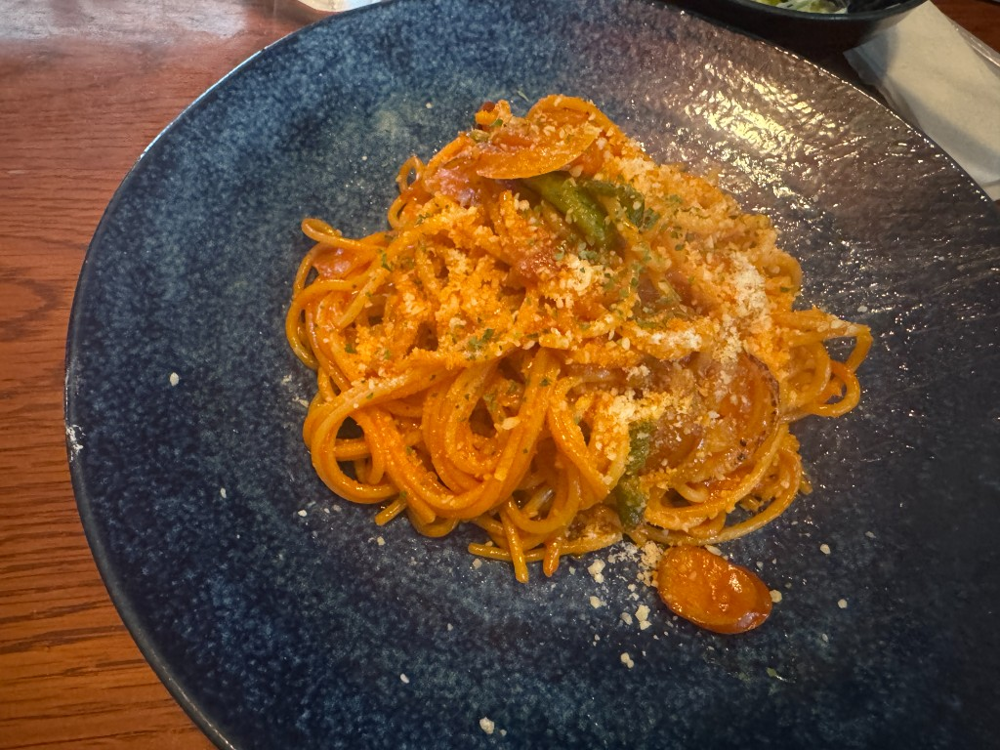
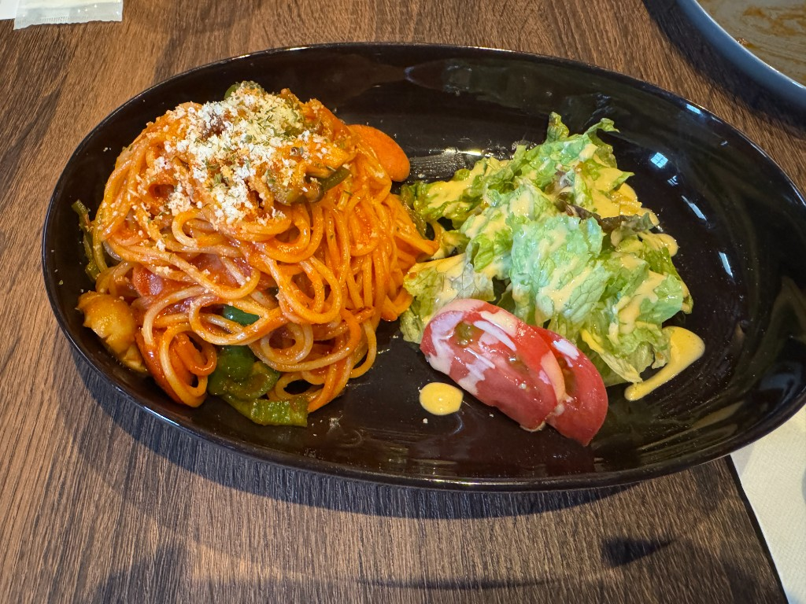

喫茶店のナポリタン、というものに前々から憧れがありました。なんか「ぽい」から。だから、最近は喫茶店に行ったらなるべくナポリタンを注文するようにしています。

「ぽい」からと食べていたナポリタンなのですが、いざ食べてると、これが信じられないくらい美味しいんですよね。喫茶店のご飯ってだいたい何でも美味いのですが、今はナポリタンがめちゃくちゃ美味しく感じるターンが来ている。そのように感じます。

これは、水前寺公園近くの「moanin」で食べたナポリタン。

味がギュッと濃縮されている感じがあり、コクもあって美味しかったです。それほど量は多くないものの、満足感がある。これで十分。というか、これがちょうどいい。野菜にも焼き目が少しついていて美味しかった記憶があります。

続いて、健軍にある「読書喫茶S'ping-すぴん-」で食べたナポリタン。

こちらはコクが凄い。おそらくバターかな？ 量も多くて、めっちゃ満足感があります。味が濃いめなので、隣にサラダが添えてあるのが助かりますね。

こういうナポリタンを食べて、家でも作ってみようと思うのですが、なかなか上手くいきません。ケチャップをたくさん入れてみても、なんか味に深みが生まれない。バターを入れてみても、なんかバターの風味がそんなにしない。喫茶店で食べるナポリタン、めっちゃ美味いんだよな〜〜〜。

というわけで、今後も喫茶店のナポリタンをいろいろと食べつつ、自分でも作って研究したいと思っています。でも、最近太ってしまったので、ナポリタンを食べる日は他の食事を調整しないといけないな……。