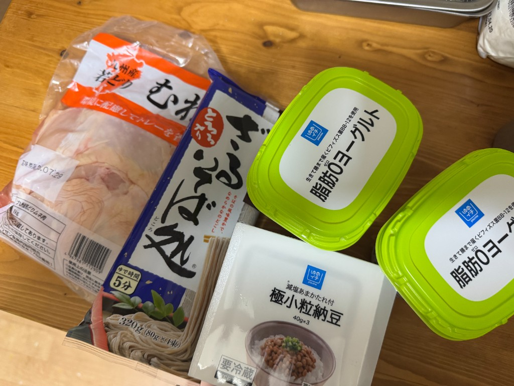

太ってしまった。1年かけて105kgあった体重を75kgくらいまで落としたのに、ここ2ヶ月の長雨と暑さを言い訳にして怠惰な生活を送っていたところ、5kgくらい太ってしまいました。もう少しで80kgになりそう。これはまずい。

運動は運動で再開するとして、減量の本丸は食事です。最近は、演劇の打ち上げで振る舞う料理の練習と言い訳して、こちらもハイカロリーかつ大容量のものを食していたので、まずはここから改めなければなりません。

どういう食事をすれば痩せるのかは大まかに分かっています。だって1年で30kg痩せたのだから。しかも、そのうち25kgくらいは半年で落としています。任せてくれ。俺は減量に詳しいんだ。

というわけで、さっきスーパーに行って、有用そうな食材を買ってきました。

- 鶏むね肉：最重要。これでたんぱく質を摂取する。肉を食べたという満足感もあって良い。焼いて食べるとパサパサするので、まず全部茹でて細かく切っておき、それを料理に使うことが多いです。なお、皮は冷凍保存しておき、演劇公演の打ち上げ料理などに使います。
- そば：これも主食としては優秀。すぐに茹でて食べられるし、満足感があるし、たんぱく質も多いです。GI値も低いので、もしかすると満腹感の維持に寄与しているかもしれない。
- 納豆：味が濃くて満足感が得られるのが良いです。そばに鶏むね肉と納豆をトッピングすればそれだけて高たんぱくかつ満足度の高いメニューになりますからね。
- 無脂肪ヨーグルト：これもたんぱく源。ちょっと甘いものが食べたい時とかに手を伸ばします。ソイプロテインとか混ぜて食べても美味しいです。

これらを使いながら、1日のカロリーとPFCバランスを計測し、運動も取り入れて減量を行っていきたいと思います。1ヶ月で3kgくらい痩せると良いなあという感じ。とりあえず7月末までやってみて、そこから8月末までどのように継続するかを考えたいですね。がんばるぞ〜。