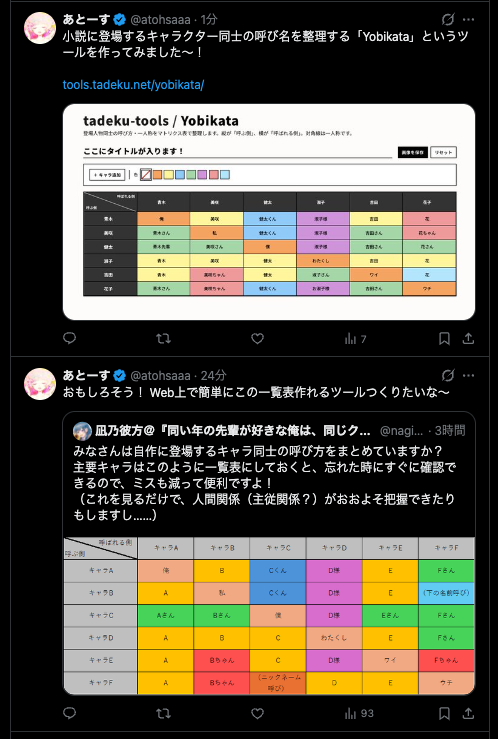

今日は、朝から「Yobikata」というWebツールを [tadeku-tools https://tadeku.net] で公開しました。

https://x.com/tadeku_net/status/2079411173779484872?s=20

小説に登場するキャラクターの呼び方を整理するためのツールです。ExcelやGoogle スプレッドシートなど既存のアプリケーションでも作れるとは思いますが、「キャラ追加」をクリックすると、列にも行にもキャラクターが追加されるというのがポイントです。

また、セルへの色付けも簡単に行うことができます。作成した表は、画像として保存することも可能です。

こちらのツールは、以下のツイートを拝見して作りました。

https://x.com/nagino_kanata/status/2079361510833631509?s=20

なお、ツイートを拝見してからツールの公開まで23分だったようです

僕がやった作業は、だいたい以下のような感じです。

- Cursorに「こういうの作りたいんだよね」と話しかける
- ボタンの位置とかを調整する
- 行にhoverすると削除ボタンが出てくるようにする
- 削除系の動作を実行する前にアラートが出るか確認する
- 画像書き出しがうまくいっているか確認する（うまくいっていなかったので、微調整した）

tadeku-toolsで使っているコンポーネントや仕組みを流用したこともあり、かなりスムーズに開発を進めることができました。

デザインや使い勝手はもっと詰めることができると思いますが、とりあえず動くツールをこうしてすぐに作って公開できるのは良いことですね。
