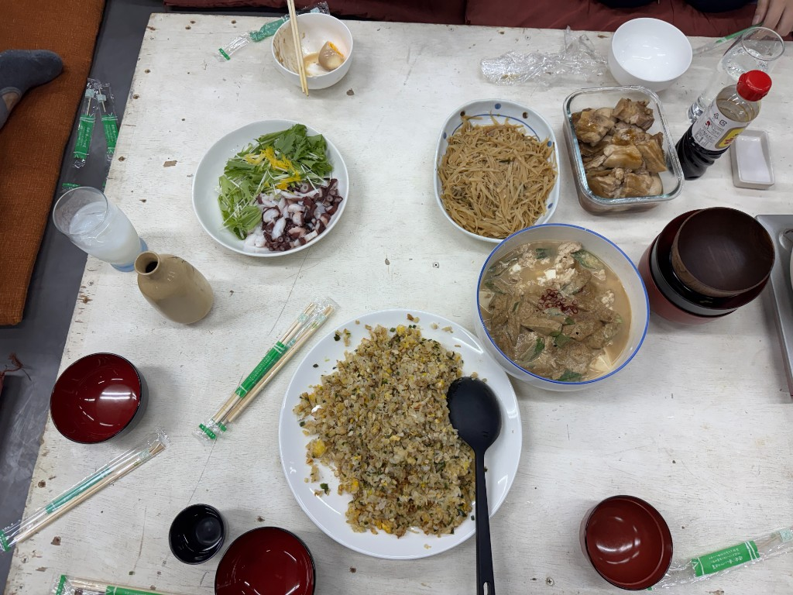
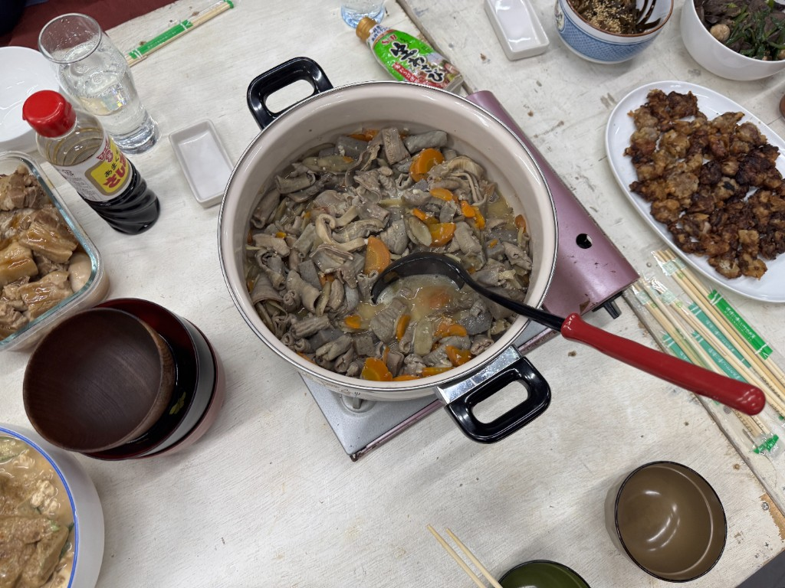
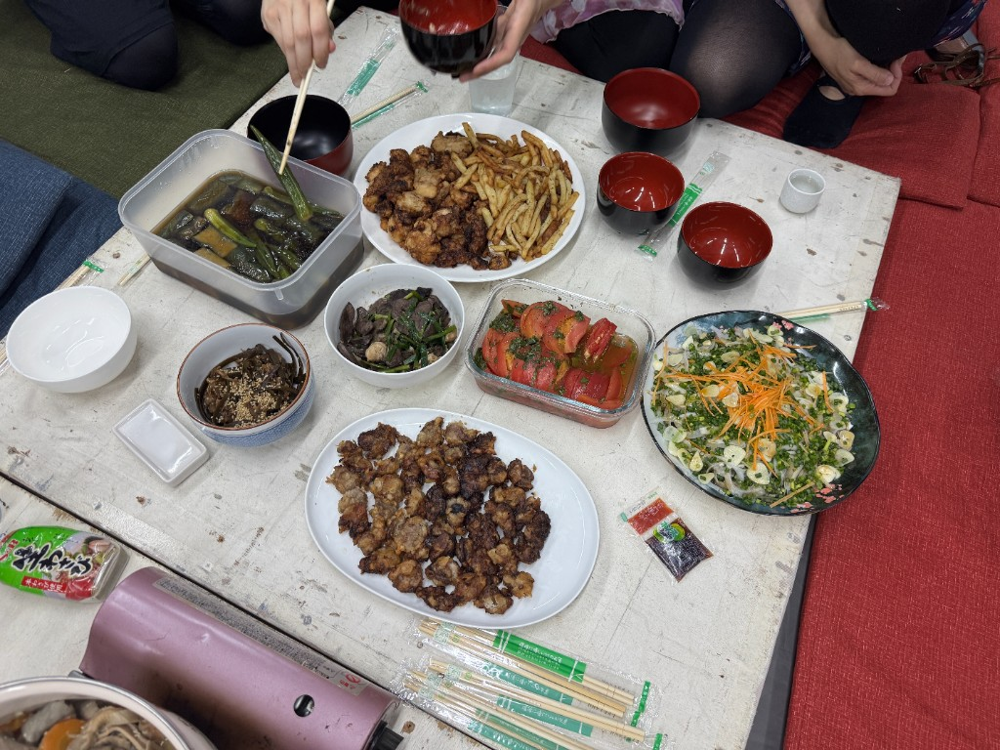

演劇公演の打ち上げ用にご飯を作りました。数えてみたところ、14品作ったようです。

今後の打ち上げ料理のために、どういうことを考えて作ったのかとか、味の感想とかをメモします。

## タコの刺身

- すでに茹でてあったタコを購入
- 薄切りにしてそのまま出してみた
- お皿として味気なかったので、水菜とレモンの皮も一緒に提供
  - しかし、これ自体に味がないため、どのようにして食べて良いのかわからず余っていた
- 次はカルパッチョとかにしても良いかもしれない

## チャーハン

- 家に作り置きしてあった鶏むねチャーシューを使ってチャーハンを作った
- ご飯は1.5合くらい
- 卵は4つ使った
- ピーマンを細かく刻んで入れてあるのがポイント

## じゃがいもの炒め物

- 千切りにしたじゃがいもを炒める
- 青唐辛子を使ってみたけど、結構辛くなった
- 思ったより茶色くなってしまったので、次は醤油を減らして、潮で味を決めても良いかも知れないと
- 千切りのピーマンとか入れても美味しいはず

## 角煮

- レシピ通りに角煮を作った
- 30分茹でて30分蒸らすのを3セット繰り返しており、かなりだるい
- 仕上がりはかなりいい感じ
- 電子レンジで温めたので、下にある味玉は黄身が固くなっていた
  - 別皿に取り分けても良いかもしれない

## 豆腐とオクラと鶏むね肉の胡麻だれがけ

- そこら辺にある材料で作ってしまった
- 豆腐の上に、作り置きしてあった鶏むねチャーシューを割いて乗せて、そこに茹でたオクラも乗せる
- タレは、ゴマペーストに醤油、酢、みりんなどを混ぜて作ったやつ
- 仕上げに鷹の爪と花椒をかけた
- 冷やし麻婆みたいな感じで美味い

## もつ煮

- 業務スーパーで買った、1kgの豚もつで作った
- 他の具は、にんじん、ごぼう、こんにゃく
- 根菜類の出汁がしっかりめに出ていて、味が決まっていた

## 揚げびたし

- 揚げ焼きした茄子とオクラを浸した
- かつお節と昆布の出汁を一応取ってみた
- 茄子の皮目が緑色になって美しくなかった
  - 一晩置くことを考えると、色止めはかなり難しいかもしれない

## 昆布とかつお節のつくだ煮

- これをつくだ煮と呼んで良いのか……？
- 出汁を取った後の昆布とかつお節を醤油、みりん、酢で炒めるだけ
- ごまもかけた気がする

## マグロハツのニラにんにく炒め

- マグロの心臓が安かったので作ってみた
- めっちゃ臭い
- 臭いことはい知っていたので、にんにくとニラを大量に入れてみたけど、ぜんぜん魚が勝ってる
  - 料理酒とか牛乳とかで漬けると良いかもしれない
  - あるいは、黒こしょうを強めに振ってみるか
- この材料でパスタ作ると美味い

## 鶏の唐揚げ

- オーソドックスな唐揚げ
- もも肉
- 醤油、みりん、にんにく、しょうがに漬ける
- 片栗粉と小麦粉を合わせたやつで揚げ焼きにする

## フライドポテト

- 業務スーパーで買った冷凍フライドポテトを揚げ焼きにした
- カレー風味にしたかったので、塩のほかに、クミン、コリアンダー、オレガノを振った
- 先ににんにくを丸揚げにして、油に香りを移しておいた。これはかなりうまくいったような気がする

## 砂ずりの唐揚げ

- 砂ずりも買っていたので、これも唐揚げにした
- もも肉の唐揚げと同じ調味液を使い、粉も一緒
- 半分くらいに切ってから揚げた
- 砂ずりは唐揚げが一番美味い

## 冷やしトマト

- トマトを切って、フレッシュバジル、塩、オリーブオイル、白ワインビネガーを入れて漬け込んでおく
- 前の日から仕込んでいて、ちょっと水が出すぎた感はある
- 当日の直前に仕込んだ方がフレッシュで美味しいかも
- しかし、前日から仕込んでおいた方が味馴染みがよく、これはこれで美味しい
  - 塩だけ後で振るとかもありかも

## カツオのたたきの薬味がけ

- カツオのたたきを買ったので、切って盛り付けて、そこに薬味をたくさん乗せた
  - 薬味は、玉ねぎ、小ねぎ、生にんにく
  - 彩りのために、ちょっとだけにんじんも入れた
  - みょうがを使いたいと思っていたけど、最近高いのでやめた
  - 刻みしょうがが入っていても美味しいかも
- ポン酢は自作した
  - 見切り品として売ってあった柑橘の切れ端の詰め合わせを買って、その果汁を絞った
  - 醤油、みりん、果汁を合わせてボトルに入れ、その中に昆布と鰹節も入れる
  - このポン酢をたっぷりかけて食べるとめちゃ美味かった
